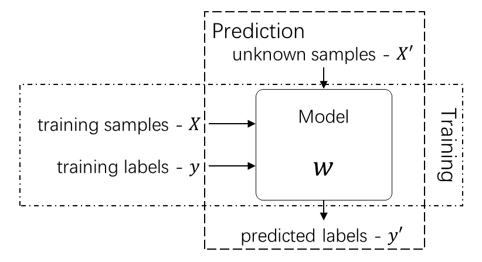

# "A" Review of MLPR (2018)

### COMMENTS
All the following contents are my personal opinions.
I'm very glad to share these knowledge and I would really 
appreciate that if you could give any comments on them.

## Outline

### What is a machine learning system

A diagram of a machine learning (ML) system is given in the figure as follow.

> An example will be given in the near future.

### Key questions in ML systems

In this review, we mainly focus on the following questions in ML systems:

 - How to represent and extract features from samples $\mathbf{x}$;
 - What different kinds of models could be for different types of labels $\mathbf{y}$;
 - How to get best parameters $\mathbf{w}$ for a model;
   - Strictly speaking, there is no such thins called "parameters" in 
    Bayesian methods. We, instead, refer $\mathbf{w}$ to the " the
    parameters of a predictor, and so they are then the variational
    parameters, or whatever description of the posterior over the original
    parameters we are using."
 - How to choose among different models.

### Represent and extract features from $\mathbf{x}$

How to represent $\mathbf{x}$:

 - original $\mathbf{x}$;
 - basis function expansion:
    - radial basis functions;
    - sigmoid basis functions;

How to extract feature:
 - autoencoder \& PCA;
 - neural networks;
 - gaussian processes;
 - kernel tricks;

### Different Models for different kinds of $\mathbf{y}$: regression \& classification

Types of labels and corresponding models:
 - for continuous $\mathbf{y}$: regression
   - linear regression;
 - for discrete $\mathbf{y}$: classification
   - softmax regression;

### Different methods for getting best parameters for a model
 - analytical solution:
   - for linear regression
 - numerical solution:
   - gradient descent \& cost funciton; 
 - optimization methods:
   - Estimation-Maximization algorithm;
 - approximation principles:
   - laplace approximations;
   - variational method \& KL divergence;
 - regularization:
   - L1
   - L2
   - early stopping

### Choosing a model among models
 - held-out validation
 - bayesian inference
   - variational inference
